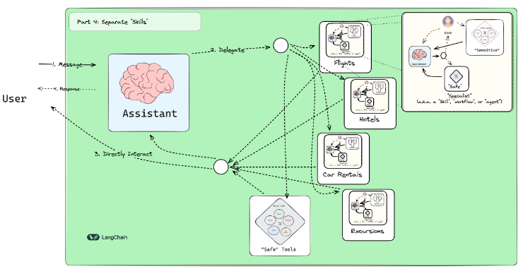

# Customer-Support-Bot
Building a Customer Support Chatbot with LangGraph



## Environment Variables
To run this project, you will need to add the following environment variables to your .env file:
```
OPENAI_API_KEY=<your-openai-api-key>
```
How to get you OpenAI API Key https://platform.openai.com/account/api-key
```
TAVILY_API_KEY=<your-tavily-api-key>
```
How to get you Tavily API Key https://docs.mindmac.app/how-to.../internet-browsing/get-tavily-key

## Run Locally
Clone the project
```
git clone https://github.com/PrMestizo/Customer-Support-Bot.git
```

Go to the project directory
```
cd Customer-Support-Bot
```

Install dependencies
```
poetry install
```

Activate the virtual environment
```
poetry shell
```
